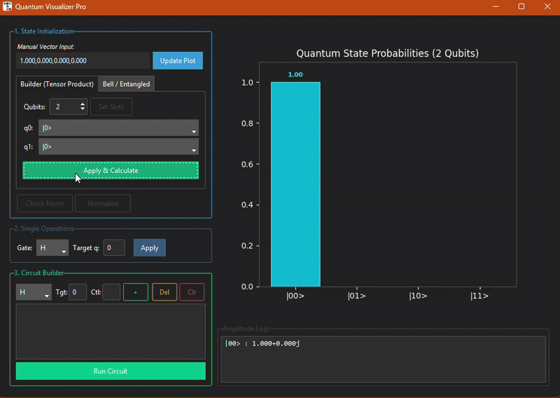

# Quantum Visualizer

A fully interactive **Quantum Circuit Simulator** and **State Visualizer** built from scratch in Python.

This project implements the mathematical foundations of quantum computing (linear algebra, tensor products, unitary matrices) using **NumPy**, wrapped in a modern **Tkinter (ttkbootstrap)** GUI. It allows users to build circuits, visualize entanglement, and observe measurement probabilities in real-time.



## Features

* ** "From Scratch" Quantum Engine:** No black-box SDKs (like Qiskit) used for the simulation logic. All matrix operations, tensor products, and state vector evolutions are hand-coded using `numpy`.
* ** Interactive Circuit Builder:**
    * Add gates (`X`, `Y`, `Z`, `H`, `S`, `T`, `CNOT`) dynamically.
    * Edit the circuit stack (Add/Delete steps) to test algorithms.
    * Visualize the operation sequence in a list format.
* ** Real-Time Visualization:**
    * **Probability Distribution:** Integrated Matplotlib bar charts showing measurement probabilities ($|\alpha|^2$).
    * **Amplitude Logs:** Detailed view of complex amplitudes ($\alpha + \beta i$) for debugging.
* ** Entanglement Suite:**
    * **Bell State Generator:** Instantly create $\Phi^+, \Phi^-, \Psi^+, \Psi^-$ and GHZ states with a single click.
    * **Tensor Product Builder:** Intuitively build multi-qubit states (e.g., $|+\rangle \otimes |0\rangle$) without manual calculation.
* ** Modern UI:** A professional dark-themed interface built with `ttkbootstrap`.

##  Installation

1.  **Clone the repository**
    ```bash
    git clone git@github.com:imane-21/quantum-visualizer.git
    cd quantum-visualizer
    ```

2.  **Install dependencies**
    ```bash
    pip install -r requirements.txt
    ```

3.  **Run the application**
    ```bash
    python -m src.main
    ```

##  Usage

### 1. State Initialization
You can initialize the system in three ways via the **Initialization** panel:
* **Manual Input:** Type the raw complex vector.
* **Builder Tab:** Select the state for each qubit ($|0\rangle, |+\rangle...$) and let the engine calculate the tensor product.
* **Bell/Special Tab:** Click on buttons like `Phi+` to instantly load an entangled Bell state.

### 2. Building a Circuit
1.  Go to the **Circuit Stack** section.
2.  Select a gate (e.g., `H`) and a target qubit.
3.  Click **"+"** to add it to the stack.
4.  Click **"Run Stack"** to execute the sequence and see the probability distribution update.

##  Technical Implementation

This project was created to demonstrate a deep understanding of the linear algebra behind quantum computing.

* **State Representation:** Quantum states are represented as complex NumPy arrays of size $2^n$.
* **Gate Application:**
    * Single-qubit gates are expanded to the full Hilbert space using Kronecker products (`np.kron`).
    * Formula for a gate $G$ on qubit $k$ in an $n$-qubit system:
      $$U = I^{\otimes k} \otimes G \otimes I^{\otimes (n-k-1)}$$
* **Simulation:** The engine performs full state-vector simulation, capable of handling entanglement and interference perfectly on small-scale systems (up to ~12 qubits).

##  Future Improvements

* **Bloch Sphere:** 3D visualization for single-qubit states.
* **Qiskit Integration:** Export built circuits to OpenQASM.


---